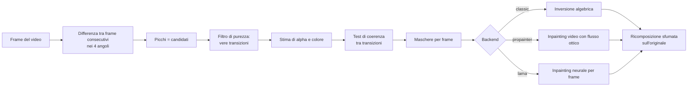

# Video Watermark Remover

[](LICENSE)

Programma didattico che individua da solo una filigrana semitrasparente, anche
quando si sposta tra gli angoli del video, e ricostruisce l'immagine sottostante
(backend classico, LaMa o ProPainter).

Nato per un caso concreto: un video 1280x720 di 8,75 s con la scritta "Luma AI"
che ogni 2 secondi salta a un angolo diverso. Il programma trova posizione,
forma e momenti esatti dei salti senza che gli venga detto nulla.

> Togliere una filigrana cancella anche l'indicazione di provenienza di un
> contenuto generato da AI. Usa questo strumento sui tuoi video e nel rispetto
> dei termini del servizio che li ha prodotti.

## Come funziona

Il punto di partenza e' il modello con cui la filigrana viene sovrapposta:

```
osservato = (1 - alpha) * sfondo + alpha * colore_filigrana
```

`alpha` e' la mappa di opacita' (la *matte*), tra 0 e 1. Se si riesce a
stimarla, la formula si inverte e lo sfondo si recupera per via algebrica,
senza inventare nulla.

### 1. Trovare i momenti in cui la filigrana si sposta

Tra due frame consecutivi lo sfondo di un video cambia pochissimo, mentre una
filigrana che compare o scompare produce un salto enorme. Il programma calcola
la differenza media tra frame consecutivi dentro ognuno dei quattro angoli e
cerca i picchi con una soglia robusta (mediana piu' k deviazioni assolute
mediane), quindi immune ai valori estremi.

### 2. Distinguere le vere transizioni dal movimento

Non tutti i picchi sono transizioni: anche un'onda o una nuvola veloce possono
produrne. Qui aiuta la fisica: sovrapporre un colore chiaro puo' solo
*schiarire* i pixel. Una comparsa ha quindi differenze quasi tutte positive e
una scomparsa quasi tutte negative, mentre un dettaglio che si sposta schiarisce
da una parte e scurisce dall'altra in misura simile.

Il programma misura questa "purezza" (frazione di variazione positiva) e tiene
solo gli eventi sopra `--min-purity`. Sul video di prova la separazione e' netta:

| tipo di salto | purezza misurata |
| --- | --- |
| transizioni vere | 0,00-0,02 e 0,95-1,00 |
| solo movimento di sfondo | 0,24-0,84 |

### 3. Stimare la forma e l'opacita'

Su una transizione il frame prima e' pulito e quello dopo e' sporco (o
viceversa), quindi:

```
alpha = (sporco - pulito) / (colore - pulito)
```

La stima si fa su tutti i canali, pesando di piu' i pixel dove lo sfondo e'
lontano dal colore della filigrana, e si media su tutte le transizioni di quello
stesso angolo. Poi il colore della filigrana viene ricavato dai pixel piu'
opachi e la stima si ripete con il valore trovato.

Restano dei granelli, dovuti al movimento dello sfondo durante la transizione.
Si eliminano con un test di coerenza: la filigrana e' identica a ogni comparsa,
quindi risulta opaca in tutte le transizioni di quell'angolo, mentre un
artefatto compare in una sola.

### 4. Ricostruire

Con la matte in mano si inverte il modello. Solo i pixel quasi opachi, dove la
divisione esploderebbe, vengono ricostruiti con l'inpainting. L'inversione
amplifica il rumore di compressione di un fattore `1/(1-alpha)`, compensato con
una lisciatura proporzionale ad alpha: l'obiettivo e' pareggiare la grana di
quello che sta intorno, non azzerarla.

Infine si prende dal risultato **solo** l'area mascherata, con un bordo sfumato,
e la si incolla sul frame originale: il resto dell'immagine non viene toccato.



## Installazione

### Windows 11: installer

Scarica `VideoWatermarkRemover-Setup.exe` dalla pagina
[Releases](https://github.com/AlessandroPierobon/Video_Watermark_Remover/releases)
(l'eseguibile non e' nel repository: pesa decine di MB).

L'installer mette a disposizione tutto quello che serve, Python 3.12 compreso:
non richiede nulla di preinstallato e non tocca eventuali altre installazioni di
Python presenti sul computer. Occupa circa 800 MB in
`%LOCALAPPDATA%\Programs\VideoWatermarkRemover` e non chiede i diritti di
amministratore.

Al primo avvio Windows mostra l'avviso "Windows ha protetto il PC", perche'
l'eseguibile non e' firmato con un certificato commerciale: *Ulteriori
informazioni* > *Esegui comunque*.

Installa: l'interfaccia grafica, un collegamento sul desktop (ci si puo'
trascinare sopra un video), una voce nel menu Start con la riga di comando gia'
configurata, e la disinstallazione registrata nelle impostazioni di Windows.

Il supporto per la scheda video si aggiunge dopo, dal menu Start, con
*Aggiungi il supporto GPU AMD*: sono altri 2,5 GB di download. Per il motore
LaMa (senza `iopaint`) basta *Aggiungi il supporto LaMa*, che installa
PyTorch CPU; se hai gia' il supporto GPU non serve.

#### Ricompilare l'installer

Serve `makensis` (`brew install makensis`, oppure `apt install nsis`) e `uv`.
Funziona anche da macOS o Linux:

```bash
./installer/compila.sh
```

Lo script scarica il runtime Python per Windows, ci aggiunge le librerie nella
variante `win_amd64`, prepara l'icona e produce l'eseguibile. La cartella di
lavoro viene riusata: il runtime si riscarica solo se manca.

### Da sorgente (macOS, Linux, Windows), backend classico

Serve solo Python 3.10 o superiore. Nessun ffmpeg di sistema: il binario e'
incluso in `imageio-ffmpeg`.

```bash
# macOS / Linux
python3 -m venv .venv && source .venv/bin/activate
pip install -e .
python interfaccia.py
```

```bat
REM Windows
py -3.12 -m venv .venv
.venv\Scripts\activate
pip install -e .
python interfaccia.py
```

Con `uv` su macOS/Linux:

```bash
uv venv --python 3.12 .venv
UV_LINK_MODE=copy uv pip install --python .venv/bin/python \
    numpy opencv-python-headless imageio-ffmpeg tqdm
```

### Windows 11 con GPU AMD RDNA4, backend ProPainter

Testato come bersaglio su Radeon RX 9070 XT (gfx1201), 16 GB di VRAM.

Chi ha usato l'installer non deve fare nulla di tutto questo: basta la voce
*Aggiungi il supporto GPU AMD* nel menu Start, che esegue gli stessi passi
(`scripts/installa_gpu.py`). Qui sotto la procedura manuale.

Due requisiti:

1. Driver Adrenalin **26.2.2** o piu' recente.
2. **Python 3.12 esatto**: le ruote ROCm per Windows esistono solo per `cp312`.

Da ROCm 7.2 in poi l'HIP SDK a parte **non serve piu'**: il runtime arriva come
pacchetti pip.

```bat
py -3.12 -m venv .venv
.venv\Scripts\activate

pip install --no-cache-dir ^
    https://repo.radeon.com/rocm/windows/rocm-rel-7.2.1/rocm_sdk_core-7.2.1-py3-none-win_amd64.whl ^
    https://repo.radeon.com/rocm/windows/rocm-rel-7.2.1/rocm_sdk_devel-7.2.1-py3-none-win_amd64.whl ^
    https://repo.radeon.com/rocm/windows/rocm-rel-7.2.1/rocm_sdk_libraries_custom-7.2.1-py3-none-win_amd64.whl ^
    https://repo.radeon.com/rocm/windows/rocm-rel-7.2.1/rocm-7.2.1.tar.gz

pip install --no-cache-dir -f https://repo.radeon.com/rocm/windows/rocm-rel-7.2.1/ ^
    torch==2.9.1+rocm7.2.1 torchvision==0.24.1+rocm7.2.1

pip install -r requirements-rocm-windows.txt
python scripts\setup_propainter.py
```

Quattro trappole note:

- L'indirizzo giusto e' `.../rocm/windows/...`, non `.../rocm/manylinux/...`:
  quello e' per Linux.
- Le ruote di `torch` dipendono da un pacchetto `rocm` che non sta su PyPI. Va
  usata la forma `-f` (find-links) mostrata sopra, oppure installato prima il
  pacchetto `rocm-7.2.1.tar.gz`: altrimenti pip si ferma con
  `No matching distribution found for rocm==7.2.1`.
- **Non usare le ruote nightly.** Non contengono i kernel per gfx1201 e ogni
  operazione su GPU fallisce con `device kernel image is invalid`.
- ProPainter ufficiale non riconosce versioni tipo `2.9.1+rocm7.2.1` e crasha
  all'import con `IndexError` in `model/misc.py`. `setup_propainter.py` e
  `installa_gpu.py` applicano automaticamente una patch; su un'installazione
  gia' fatta: `python scripts/setup_propainter.py --patch-only --dir ...`.

Il Ryzen 7 9700X ha una GPU integrata: se PyTorch sceglie quella sbagliata,
isolare la scheda dedicata con `set HIP_VISIBLE_DEVICES=0`.

Con le build ROCm la GPU AMD si presenta come dispositivo `cuda`: e' voluto.
Verifica con:

```bat
python -c "import torch; print(torch.cuda.is_available(), torch.cuda.get_device_name(0))"
```

### Backend LaMa (facoltativo)

Serve solo PyTorch. I pesi Big-LaMa (~200 MB) si scaricano al primo utilizzo
nella cache di Torch Hub.

```bash
pip install torch
# oppure, se hai gia' installato il progetto in editable:
pip install -e ".[lama]"
```

Non usare piu' `pip install iopaint`: su Python 3.13+ la sua CLI e' rotta
(modulo `imghdr` rimosso) e spesso arriva senza dipendenze.

## Uso

### Interfaccia grafica

```bash
python interfaccia.py [video.mp4]
```

Su Windows la avvia il collegamento sul desktop. Si sceglie il video (anche
trascinandolo nella finestra o sull'icona del programma), il motore e le
opzioni; il registro e la barra mostrano l'avanzamento, e il calcolo si puo'
interrompere. La finestra non fa il lavoro in proprio: lancia `dewatermark.py`
come processo separato, quindi ha esattamente lo stesso comportamento della
riga di comando.

### Riga di comando

```bash
# analisi soltanto: matte, grafici, video con le maschere evidenziate
python dewatermark.py -i video.mp4 --detect-only --debug-dir out/debug

# rimozione senza GPU
python dewatermark.py -i video.mp4 -o out/pulito.mp4

# qualita' massima su GPU, con video di confronto affiancato
python dewatermark.py -i video.mp4 -o out/pulito.mp4 --backend propainter --compare
```

`--dry-run` stampa il comando che verrebbe passato al backend esterno senza
eseguirlo: utile per controllare i parametri prima di avviare un calcolo lungo.

### Opzioni principali

| opzione | a cosa serve |
| --- | --- |
| `--backend classic\|propainter\|lama` | motore di ricostruzione |
| `--detect-only` | analizza e basta |
| `--debug-dir CARTELLA` | matte, grafico delle transizioni, video con le maschere, confronti prima/dopo |
| `--compare` | salva anche un video con originale e risultato affiancati |
| `--mask-dilation N` | quanto allargare la maschera (default 6 px) |
| `--feather N` | ampiezza della sfumatura al bordo (default 8 px) |
| `--unblend-max V` | oltre questa opacita' si passa all'inpainting (default 0,75) |
| `--unblend-denoise V` | lisciatura del rumore amplificato (default 0,25) |
| `--manual-box x,y,w,h` | rettangolo fisso, se il rilevamento fallisce |
| `--force-corners 0-47:tl,48-95:tr` | pianificazione imposta a mano |
| `--max-frames N` | elabora solo i primi N frame, per prove veloci |

### Se il rilevamento non trova nulla

Il metodo ha bisogno di vedere almeno una comparsa o una scomparsa. Nell'ordine:

1. Se hai usato `--max-frames`, allarga il tratto analizzato.
2. Abbassa `--mad-k` (per esempio a 3,5) per accettare picchi piu' deboli.
3. Abbassa `--min-purity` (per esempio a 0,75) se lo sfondo e' molto mosso.
4. Se la filigrana non si sposta mai, usa `--manual-box x,y,larghezza,altezza`:
   in quel caso la zona viene interamente ricostruita con l'inpainting.

## Scelta del backend

| backend | dove gira | tempi sul video di prova (210 frame, 720p) | qualita' |
| --- | --- | --- | --- |
| `classic` | ovunque, solo CPU | ~18 s su Apple M1 | ottima se la filigrana e' semitrasparente |
| `lama` | CPU o GPU | qualche minuto | ottima per frame singolo, puo' sfarfallare |
| `propainter` | solo GPU | pochi minuti su GPU adeguata | la migliore, coerente nel tempo |

Il backend `classic` vince quando la filigrana e' semitrasparente, perche' non
inventa nulla: recupera i pixel veri. `propainter` serve quando la filigrana e'
opaca e l'informazione sottostante e' andata persa davvero: in quel caso i pixel
vengono presi dagli altri frame seguendo il movimento della scena.

### Memoria richiesta da ProPainter

Valori dichiarati dal progetto originale, fp32 / fp16:

| risoluzione | 50 frame | 80 frame |
| --- | --- | --- |
| 1280x720 | 28 GB / 19 GB | esaurisce / 25 GB |
| 720x480 | 11 GB / 7 GB | 13 GB / 8 GB |
| 640x480 | 10 GB / 6 GB | 12 GB / 7 GB |
| 320x240 | 3 GB / 2 GB | 4 GB / 3 GB |

Con 16 GB di VRAM a 720p il valore predefinito `--subvideo-length 32` con fp16
sta abbondantemente dentro il budget. Se la memoria non basta comunque:
abbassare ancora `--subvideo-length`, ridurre `--neighbor-length`, alzare
`--ref-stride`, oppure usare `--resize-ratio 0.5`.

## Risultati sul video di prova

Rilevamento corretto al primo tentativo, 8 transizioni, ciclo di 2 secondi
esatti tra i quattro angoli:

```
alto-sinistra    frame    0-48   ( 0.00s -  2.00s), 15807 px coperti
alto-destra      frame   47-96   ( 1.96s -  4.00s), 15636 px coperti
basso-destra     frame   95-144  ( 3.96s -  6.00s), 15799 px coperti
basso-sinistra   frame  143-192  ( 5.96s -  8.00s), 15854 px coperti
alto-sinistra    frame  191-209  ( 7.96s -  8.71s), 15807 px coperti
```

La filigrana e' risultata opaca al 31% in media (massimo 52%), quindi il
backend classico ha potuto recuperare lo sfondo per via algebrica, senza
ricorrere all'inpainting. Misurando il contrasto locale medio sotto l'area della
filigrana, prima e dopo:

| frame | prima | dopo | sfondo circostante |
| --- | --- | --- | --- |
| 24 (alto-sinistra) | +16,5 | -0,2 | -2,2 |
| 71 (alto-destra) | +12,0 | -0,5 | -1,6 |
| 119 (basso-destra) | +20,3 | -0,0 | -2,7 |
| 167 (basso-sinistra) | +21,0 | -0,4 | -2,8 |

La traccia della scritta sparisce anche esaltando il contrasto di cinque volte.

## Limiti

- Serve almeno una transizione nel tratto analizzato: una filigrana sempre ferma
  va indicata con `--manual-box`.
- La stima del colore e' pensata per filigrane chiare (viene limitata
  all'intervallo 180-255 per canale). Per una filigrana scura andrebbe
  generalizzata.
- Il backend `classic` recupera lo sfondo solo dove la filigrana e'
  semitrasparente. Dove e' opaca l'informazione non c'e' piu' e si ricade
  sull'inpainting, che inventa.
- Si esplorano i quattro angoli: una filigrana al centro va indicata a mano.

## Struttura

```
dewatermark.py              interfaccia da riga di comando
interfaccia.py              finestra grafica, avvia dewatermark.py come processo
pyproject.toml              metadati e dipendenze del pacchetto
requirements-rocm-windows.txt
wmremove/
  detect.py                 rilevamento, stima della matte, maschere, diagnostica
  compose.py                fusione sfumata sull'originale
  video_io.py               lettura, scrittura, ffmpeg incluso
  backends/
    classic.py              inversione algebrica piu' inpainting
    propainter.py           inpainting video su GPU
    lama.py                 inpainting neurale per frame
scripts/
  setup_propainter.py       codice di ProPainter e download dei pesi
  installa_gpu.py           ROCm, PyTorch e ProPainter in un colpo solo
  installa_lama.py          PyTorch CPU per LaMa (senza iopaint)
installer/
  compila.sh                costruisce l'installer per Windows
  compila.ps1               stessa cosa, nativo PowerShell
  installer.nsi             pagine, collegamenti, disinstallazione
  crea_icona.py             disegna icona.ico
  riga-di-comando.cmd       prompt con il Python del programma
  supporto-gpu.cmd          lancia installa_gpu.py
  supporto-lama.cmd         lancia installa_lama.py
```

## Licenza

Distribuito sotto [Apache License 2.0](LICENSE).
